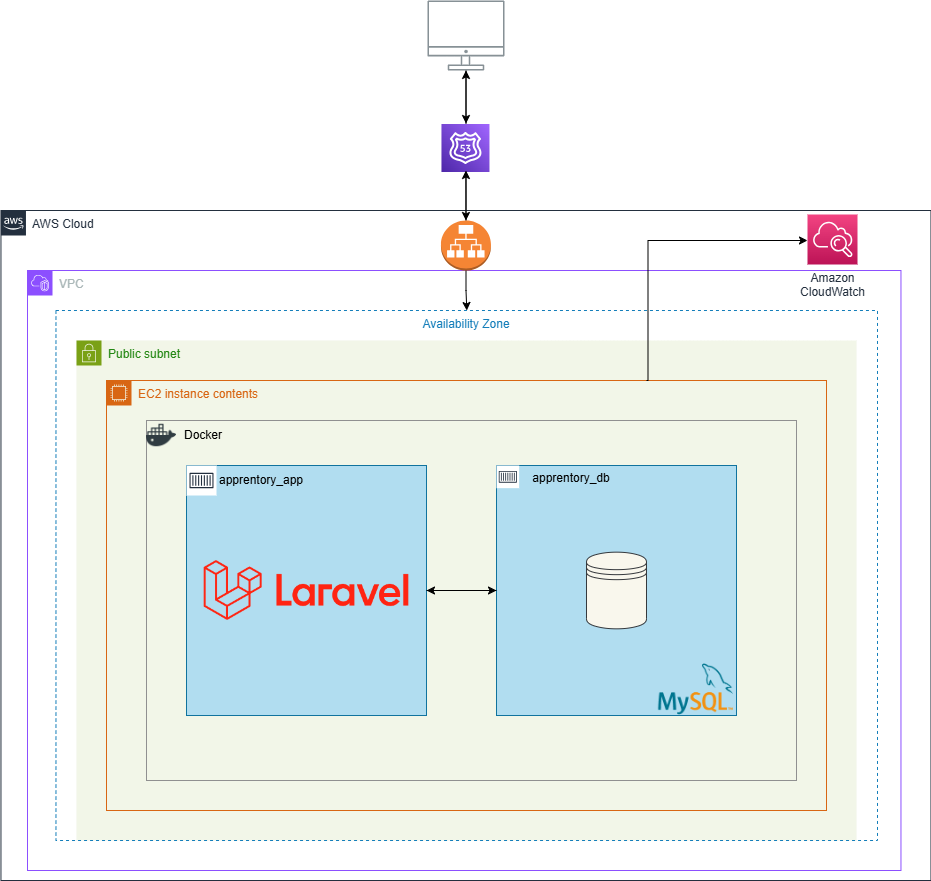
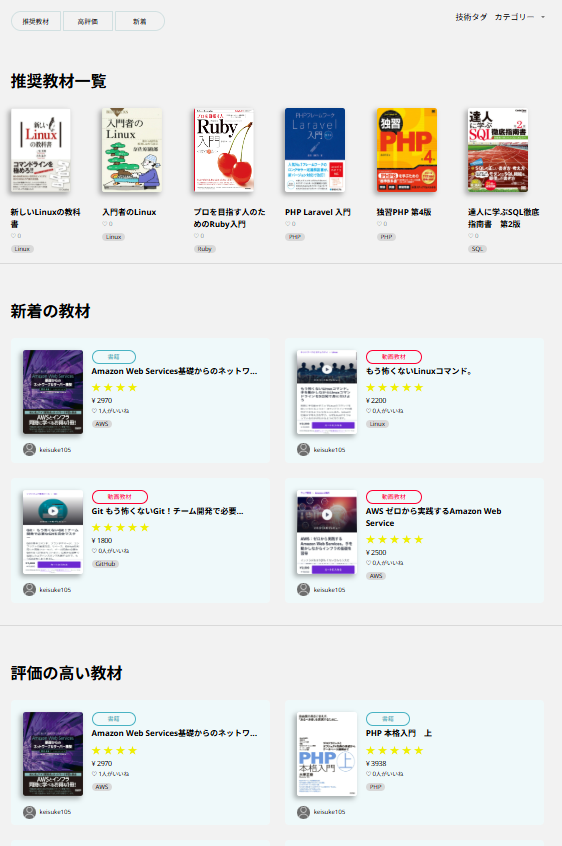
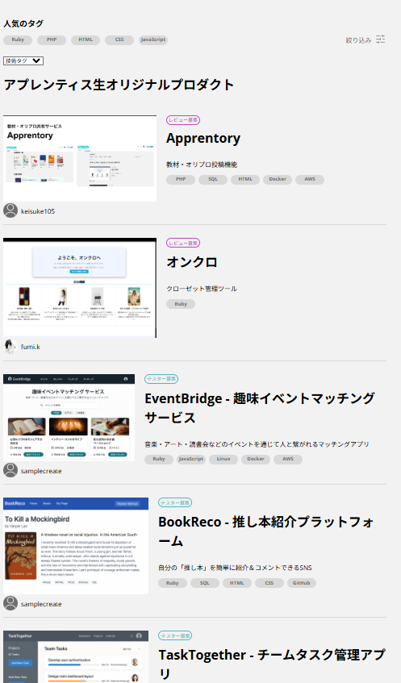

## Apprentory
『Apprentory』は、アプレンティス生向けに作成した教材、オリジナルプロダクト共有サイトです。 
アプレンティス生が学習で使用した教材や、制作したプロダクトを共有することで、同期・他期との交流やスムーズな学習進行をサポートします。  

### リンク: https://apprentory.click/

## トップページ

## インフラ構成図

## ER図

## 使用技術スタック
- PHP (バージョン追記)
- Laravel (バージョン追記)
- MySQL (バージョン追記)
- AWS (EC2 ELB Route53）
- Docker
- JavaScript
- HTML/CSS

## 機能・画面
### ログイン機能
- Discord IDによる認証後、任意のユーザIDとパスワードでログイン可能です。  
ホーム画面に遷移後に各機能を使用できます。

### 一覧
- アプレンティス生が共有した教材やオリジナルプロダクトを閲覧することが出来ます。

カテゴリや使用言語毎の絞込みも可能です。

<table>
  <tr>
    <td align="center">
      <strong>教材一覧</strong> 
      
    </td>
    <td align="center">
      <strong>オリプロ一覧</strong> 
      
    </td>
  </tr>
</table>

### 教材・オリジナルプロダクト共有
- 自分が使用した教材、作成したオリジナルプロダクトを共有出来ます。 
- 教材は5段階での評価に対応しており、媒体(書籍なのか動画コンテンツなのか、等)の選択が可能です。 
- オリジナルプロダクトには複数枚の画像を添付でき、テスター募集やレビュー募集など、投稿の目的に応じた種別を選択できます。

投稿動画貼る
(教材とオリプロ)

### 詳細の閲覧
- 投稿された記事の詳細を閲覧出来ます。
- 教材にはいいね機能、オリジナルプロダクトにはコメント欄を実装しています。

#### 教材詳細画面

#### オリプロ詳細画面

### 検索機能
- サイト内検索に対応しており、言語、もしくはテキストから一致するものを絞り込めます。

### フォロー機能
- 気になったユーザをフォローする事が出来ます。

### 通知機能
- 他ユーザからのアクション（フォロー・いいね・コメント）をリアルタイムで通知するため、Discord Botとの連携による通知機能を実装しました。

## 技術的に工夫したところ
### ユーザをアプレンティス生のみに絞込むため、Discord APIを使用して登録可能なユーザを限定しました。 
他ユーザからのアクションをリアルタイムで通知出来るよう、Botを経由した通知機能を実装しました。

本番環境には CloudWatch を導入し、CPU・メモリ・ディスク使用率などの監視体制を構築。安定運用を支えています。
## ユーザ目線で工夫したところ
- アプレンティス生の「どの教材を選ぶべきか分からない」という悩み、そして「オリジナルプロダクトの要件定義が進まない」という壁をサポートするため、本サービスは教材共有とオリプロ投稿の2機能を軸に設計しています。それぞれが“失敗しづらい選択・企画”を後押しする「学習の心臓部」として機能することを目指しました。
- SNSとしての使いやすさを重視し、投稿・いいね・コメント・フォロー・通知といった機能を一般的なサービスに倣って設計しました。ユーザーが迷わず使えるよう、既存SNSのUI/UXを積極的に参考にしています。
- JavaScriptを活用し、可能な限りページ遷移を発生させない構成とすることで、操作のテンポを向上させました。
